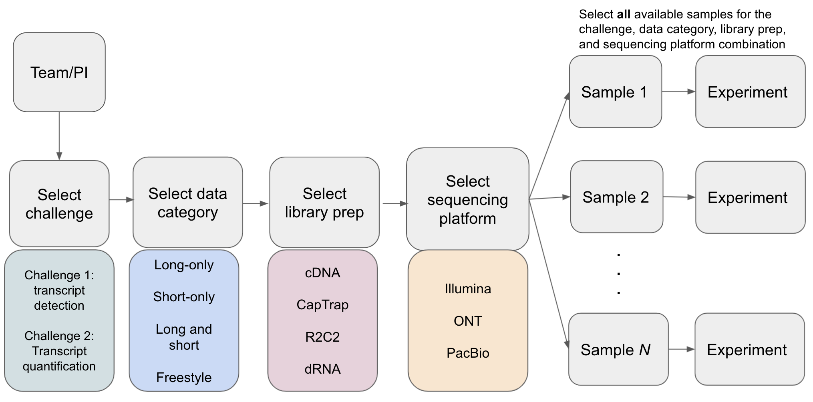
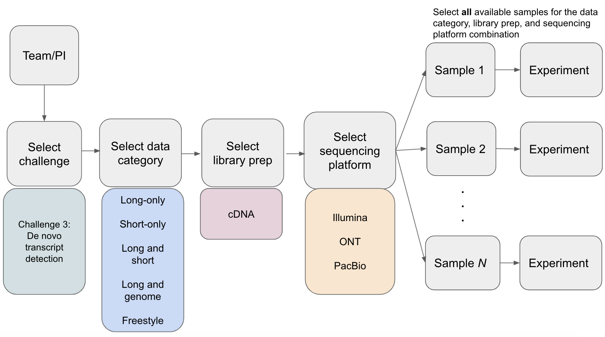

# Challenges

For details on result files that must be submitted, see [Submission structure](submission.md).

* Challenge 1: transcript isoform detection with a high-quality genome (`iso_detect_ref`)
  * Samples
    * `WTC11` (human iPSC cell line)
    * `H1_mix` (human H1 ES cell line mixed with human Definitive Endoderm derived from H1)
    * `ES` (mouse ES cell line)
    * `human_simulation` - simulated human reads (Illumina, ONT cDNA, and PacBio cDNA)
    * `mouse_simulation` - simulated mouse reads (Illumina and PacBio cDNA, ONT dRNA)
  * Result files:
    * `models.gtf.gz`
    * `read_model_map.tsv.gz`

* Challenge 2: transcript isoform quantification (`iso_quant`)
  * Samples
    * `WTC11` (human iPSC cell line)
    * `H1_mix` (human H1 ES cell line mixed with human Definitive Endoderm derived from H1)
    * `human_simulation` - simulated human reads (Illumina, ONT cDNA, and PacBio cDNA)
    * `mouse_simulation` - simulated mouse reads (Illumina and PacBio cDNA, ONT dRNA)
  * Result files:
    * `expression.tsv.gz`
    * `models.gtf.gz`

* Challenge 3: de novo transcript isoform detection (`iso_detect_de_novo`)
  * Samples
    * `Manatee` (manatee whole blood)
    * `ES` (mouse ES cell line)
  * Result files:
    * `rna.fasta.gz`
    * `read_model_map.tsv.gz`

## Challenge requirements

Computational methods may have been developed and tuned to a specific sequencing platform, library prep approach(e.g. ONT dRNA), or use of additional orthogonal data; therefore, entries are organized such that a comparison can be made across different tools using the same type of data. Additionally, it is important to evaluate how robust computational tools are to transcript analysis in different species or biological samples. Thus, for each *entry* to a challenge, a team will select a *data category*, library prep, and sequencing platform and submit *experiments* for all samples that are available for the challenge + library prep + sequencing platform combination. The samples that are available for a challenge + library prep + sequencing platform combination can be found in the [LRGASP RNA-seq Data Matrix](rnaseq-data-matrix.md). Note that there are also simulated samples that should also be selected for Challenges 1 and 2.

Each *entry* must meet the following requirements:

### Requirements for Challenge 1 and 2

* At least one *experiment* must be supplied for each *sample* available for
  a given challenge, library prep, and sequencing platform combination that is selected. Human and mouse samples will have biological replicates that must be used for the entry.
* A major goal of LRGASP is to assess the capabilities of long-read sequencing for transcriptome analysis and also how much improvement there is over short-read methods. Additionally, long-read computational pipelines vary in their use of only long-read data or if they incorporate additional data for transcript analysis. To facilitate comparisons between long-read and short-read methods and variation in tool parameters, we organize entries into different *data categories*:
  * *long-only* - Use only LGRASP-provided long-read RNA-Seq data from a single sample, library preparation method and sequencing platform.
  * *short-only* - Use only LGRASP-provided short-read Illumina RNA-Seq data from a single sample. This is to compare with long-read approaches
  * *long and short* - Use only LGRASP-provided long-read and short-read RNA-Seq data from a single long-read library preparation method and the Illumina platform. Additional accessioned data in public genomics data repositories can also be used.
  * *freestyle* - Any combination of at least one LRGASP data set as well as any other accessioned data in public genomics data repositories. For example, multiple library methods can be combined (e.g. PacBio cDNA + PacBio CapTrap, ONT cDNA + ONT CapTrap+ ONT R2C2+ ONT dRNA, all data, etc.).  LRGASP simulated reads may not be used in *freestyle* experiments.

In all the above categories, the genome and transcriptome references specified by LRGASP should be used. For the *long and short* and *freestyle* category, additional transcriptome references can be used.

All replicates must be used in each experiment. For Challenge 1, different pipelines may treat replicates differently: for example the data could be combined or replicate information used to determine high-confidence transcripts. That will be up to the submitter.

Each team can submit multiple entries for each challenge; however, they can only submit one entry per challenge + data type + library prep + sequencing platform combination. This is to encourage tool development that is robust to different library preps and sequencing platforms, but prevent multiple entries that are subtle parameter changes.

For Challenge 1, the submitted GTF file should only contain transcripts that have been assigned a read.

* The type of platform and libraries preparation method used in a given *experiment*, except for *freestyle* experiments, is limited to data from a single library preparation method plus sequencing technology (*long-only*).  LRGASP Illumina short-read data of the same sample may optionally be used in an experiment with the LRGASP long-read data (*long and short*)
  * Illumina cDNA - *short-only*
  * Pacbio cDNA - *long-only* or *long and short*
  * Pacbio CapTrap - *long-only* or *long and short*
  * ONT cDNA - *long-only* or *long and short*
  * ONT CapTrap - *long-only* or *long and short*
  * ONT R2C2 - *long-only* or *long and short*
  * ONT dRNA - *long-only* or *long and short*
  * Simulation - *long-only* or *long and short*

#### Additional guidelines for Challenge 2

* For Challenge 2, submitters have the option of quantifying against the reference transcriptome or a transcriptome derived from the data (i.e., results from Challenge 1). The GTF used for quantification is included as part of the [Challenge 2 submission](submission.md). Submitters are allowed to submit one quantification using the reference and one quantification using a custom GTF.

* Challenge 2 must report replicate quantification separately in the [expression matrix](expression_matrix_format.md).

* Due to the challenges of isoform-level quantification and the lack of a gold standard, we devised a mixture sample, `H1_mix`, in which an undisclosed ratio of two samples is mixed before sequencing. For validation, we sequenced `H1` and `endodermal cell` (derived from H1) samples individually to establish the isoforms present in only one or the other sample before mixing. In essence, the pre-mixed sample represents the “ground truth” of isoform expression before the mix. After the close of LRGASP submissions on October 1, the `H1` and `endodermal cell` data will be released.
  * Participants of Challenge 2, will need to provide transcript quantification from these additional datasets **using the same GTF and same computational pipeline from the original submission**, i.e., the GTF and pipeline used to quantify `H1_mix`. Libraries and computational pipelines can then be evaluated based on how well the transcript quantification in the `H1_mix` sample represents the expected ratios determined from quantification from the individual cell lines, `H1` and `endodermal cell`. These submissions will be due 1 month after the main close of submissions, **November 1**.

### Requirements for Challenge 3

* At least one *experiment* must be supplied for each *sample* available for a given library prep and sequencing platform combination that is selected. Mouse samples will have biological replicates that should be used for the entry. Manatee samples only have cDNA library prep type and sequenced on Illumina, ONT, and PacBio.
* For similar reasons as described above, the data used for a given experiment must fit in one of the following data categories:
  * *long-only* - Use only LGRASP-provided long-read RNA-Seq data from a single sample, library preparation method and sequencing platform. No genome reference can be used.
  * *short-only* - Use only LGRASP-provided short-read Illumina RNA-Seq data from a single sample. This is to compare with long-read approaches. No genome reference can be used.
  * *long and short* - Use only LGRASP-provided long-read and short-read RNA-Seq data from a single long-read library preparation method and the Illumina platform. No genome reference can be used.
  * *long and genome* - Use only LGRASP-provided long-read RNA-Seq data from a single long-read library preparation method. A genome sequence can be used.
  * *freestyle* - Any combination of at least one LRGASP data set as well as any other accessioned data in public genomics data repositories. For example, multiple library methods can be combined (e.g. PacBio cDNA + ONT cDNA).

In all the above categories, except for *freestyle*, a transcriptome reference CANNOT be used.

The submitted FASTA file should only contain transcripts that have been assigned a read.

Each team can submit multiple entries for each challenge; however, they can only submit one entry per challenge + data type + library prep + sequencing platform combination. This is to encourage tool development that is robust to different library preps and sequencing platforms, but prevent multiple entries that are subtle parameter changes.
