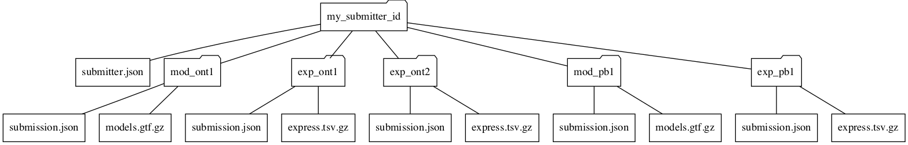

# Submission structure

Submissions to LRGASP consist of a set of experiments targeting a particular
challenge submitted by a *team*.  With two types of experiments: *model* and
*expression*.  Model experiments are genomic transcript model predictions, and
expression experiments are transcript expression quantification of a set of
submitted models.

A given challenge may combine results from multiple, distinct experiments.
For instance, the high-quality genome isoform annotation challenge will
include both human and mouse experiments. To accommodate this, *experiments*
are grouped into *entries* against a particular challenge.  An *entry* is
the unit of both submission and evaluation.  The *experiments* in an *entry*
should uses as similar a set of parameters and data to allow
for the meaningful combination of the results.

When a team registers for LRGASP on [Synapse](https://www.synapse.org/#!Synapse:syn25007472/wiki/608702), they are assigned a
[Synapse identifier](metadata-identifiers.md#synapse-identifiers), called the ``team_id``.  Other symbolic
experiment identifiers assigned by the team and must be valid
[symbolic identifier](metadata-identifiers.md#symbolic-identifiers), as described below.

The [example entries](https://github.com/LRGASP/lrgasp-submissions/tree/master/examples/darwin_lab) will be useful in understanding structure.

## Submission overview

This diagram shows the general logical and directory structure of LRGASP entries,
which are explain below.

## Entry structure

Each ``entry`` must conform to fix, straight-forward file hierarchy.
Each entry to a challenge is in a directory with the same name as the `entry_id`.
The entry ids must be prefixed with the [Challenge identifier](metadata-identifiers.md#challenge-identifiers) followed by
a `_` and a unique team-defined name.  For instance:

- `iso_detect_ref_darwin_drna_ont`
- `iso_quant_ont_darwin`
- `iso_detect_de_novo_darwin`

The entry directory contains an `entry.json` [entry metadata](metadata.md#entryjson)
describing the entry.  There is a directory per experiment within the entry directory, with each directory named the same as the
submitter-defined ``experiment_id`.

All entries MUST be validated with the provided [submission tools](submission-tools.md) before uploading.

## Experiment structure

Challenge 1 model experiments must contain the following files:

- `experiment.json` - [Experiment metadata](metadata.md#experimentjson) describing the experiment results
- `models.gtf.gz` - [GTF file](model-format.md) with model annotations, compressed with gzip.
- `read_model_map.tsv.gz` [Read to model map file](read_model_map_format.md) that associates every transcript model the GTF with a least one read.

Challenge 2 quantification experiments must contain the following files:

- `experiment.json` - [Experiment metadata](metadata.md#experimentjson) describing the experiment results
- `expression.tsv.gz` - [Expression matrix file](expression_matrix_format.md) with the results of the experiment, which must be in TPM.
- `models.gtf.gz` - [GTF file](model-format.md) with target model annotations, compressed with gzip.

Challenge 3 novel model experiments must contain the following files:

- `experiment.json` - [Experiment metadata](metadata.md#experimentjson) describing the experiment results
- `rna.fasta.gz` - FASTA file with model RNA sequences, compressed with gzip.
- `read_model_map.tsv.gz` [Read to model map file](read_model_map_format.md) that associates every transcript model in the FASTA with a least one read.

## Detailed specifications

- [Metadata](metadata.md)
- [Reference genomes and transcripts](reference-genomes.md)
- [Transcript model format](model-format.md)
- [Read to model map format](read_model_map_format.md)
- [Transcript expression matrix format](expression_matrix_format.md)
- [Example entries](https://github.com/LRGASP/lrgasp-submissions/tree/master/examples/darwin_lab)
- [Submission tools](submission-tools.md)
- [Synapse submissions](synapse.md)
