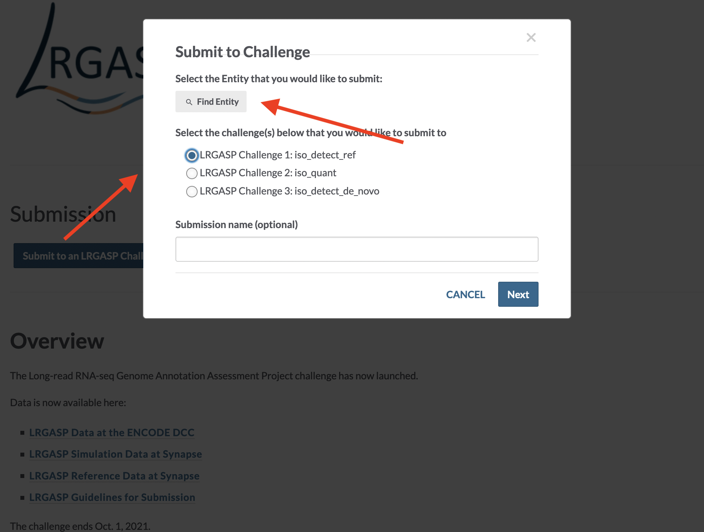
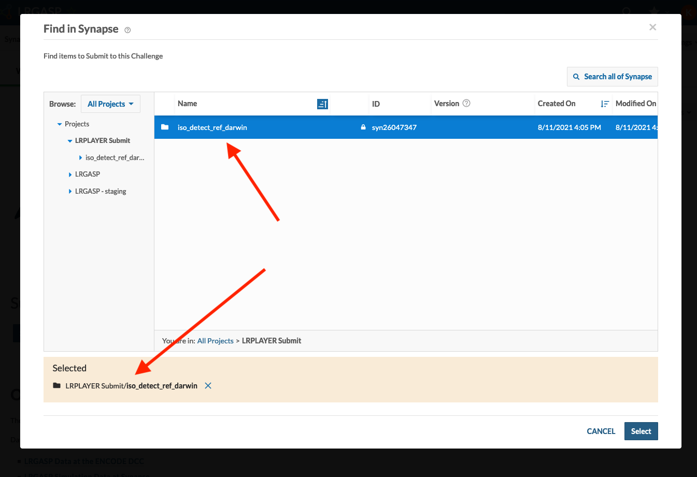

# Synapse submissions

Submission to LRGASP is managed by [SAGE Synapse](https://www.synapse.org) system.
Synapse is used to control access for participant submission, allowing data to be shared
only with the LGRASP evaluators.  The Synapse evaluation results report facility is not
used.

Note that the use of the term "challenge" has different meanings for Synapse and
LRGASP.  LRGASP as a whole is a Synapse challenge.  Each LRGASP challenge is
a Synapse sub-challenge, represented by a Synapse evaluation queue.

## Configuring your Synapse accounts

1. All individuals in the lab that will be using Synapse to submit must create
   an account and pass the easy certification quiz as described in
   [Getting Started with Synapse](https://docs.synapse.org/articles/getting_started.html).
1. The lab can create a [Synapse team](https://help.synapse.org/docs/Teams.1985446029.html) (e.g. "Darwin LRGASP Team") to allow
   multiple users in the lab to upload.
1. Participating Lab members should join these teams:
    * the lab team ("Darwin LRGASP Team")
    * "LRGASP Participants"
1. Create a Synapse project (e.g., "Darwin LRGASP Project") that will be used
   to contain uploaded entries before submission to an LRGASP evaluation
   queue.
1. Set project sharing for the lab project ("Darwin LRGASP Project") to be
   the lab team ("Darwin LRGASP Team") to `Can edit & delete`

## Uploading LRGASP challenge entries

The command ``lrgasp-upload-entry`` is provided to upload an entry to a lab's project.  As input, it takes an entry directory. The entry
should first be validated with ``lrgasp-validate-entry``

One logs into Synapse using one's Synapse user name or
registered e-mail.  The user is specified with
``-u <user>`` to  ``lrgasp-upload-entry`` or using
the ``synapse`` command to cache your credentials to
avoid entering the password each time.

```
  synapse login -u cdarwin@cam.ac.uk  --remember-me
```

Upload the entry to your lab's project either by name or Synapse id:

```
  lrgasp-upload-entry -u cdarwin@cam.ac.uk results/darwin_lab/iso_detect_ref_darwin_drna_ont "Darwin LRGASP Project"

  lrgasp-upload-entry -u cdarwin@cam.ac.uk results/darwin_lab/iso_detect_ref_darwin_drna_ont syn123456
```

If you make changes to the entry, just rerun the upload.  If the uploaded entry has already been
submitted to an evaluation queue, please get in touch with [lrgasp-support-group@ucsc.edu](mailto:lrgasp-support-group@ucsc.edu)
and let us know you have made changes.

## Submit entry to LRGASP

To submit to LRGASP, go to [https://www.synapse.org/LRGASP](https://www.synapse.org/LRGASP) and
click *Submit to an LRGASP Challenge*.  In the window that opens, click *Find Entity* and
select the entry directory to submit.  Please ensure that the entry directory is select,
as shown below.

Once submitted, mail [lrgasp-support-group@ucsc.edu](mailto:lrgasp-support-group@ucsc.edu) and let
us know you have submitted.  Please include your lab's synapse name,
team name, and the name of the submission in the email.  We will send you a positive
acknowledgment that we have received the entry.




